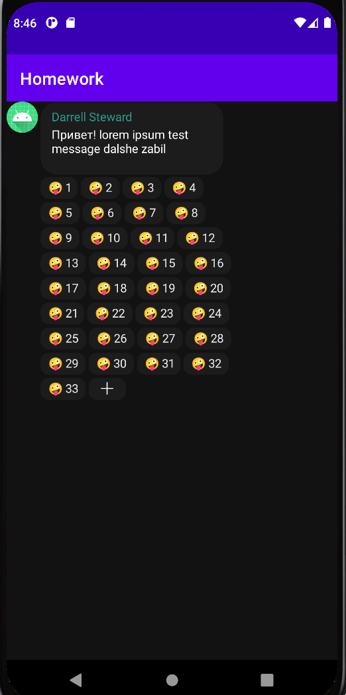

#### Кастомная View для отображения Emoji реакции и кол-ва реакций

Реализована ReactionView. 
Возможность задавать из кода emoji и кол-во реакций сделана через атрибуты и через публичное свойство textToDraw.

#### FlexBoxLayout

Реализован FlexboxLayout.
Через атрибуты можно задать maxCountInRow - количество элементов в строке и margin - марджин между элементами по горизонтали и вертикали.
ImageView с иконкой + реализован через PlusView. Добавление происходит в FlexboxFactory.

#### Кастомная ViewGroup, которая отображает сообщение вместе с реакциями т.е.
Реализован CompanionMessageLayout.

